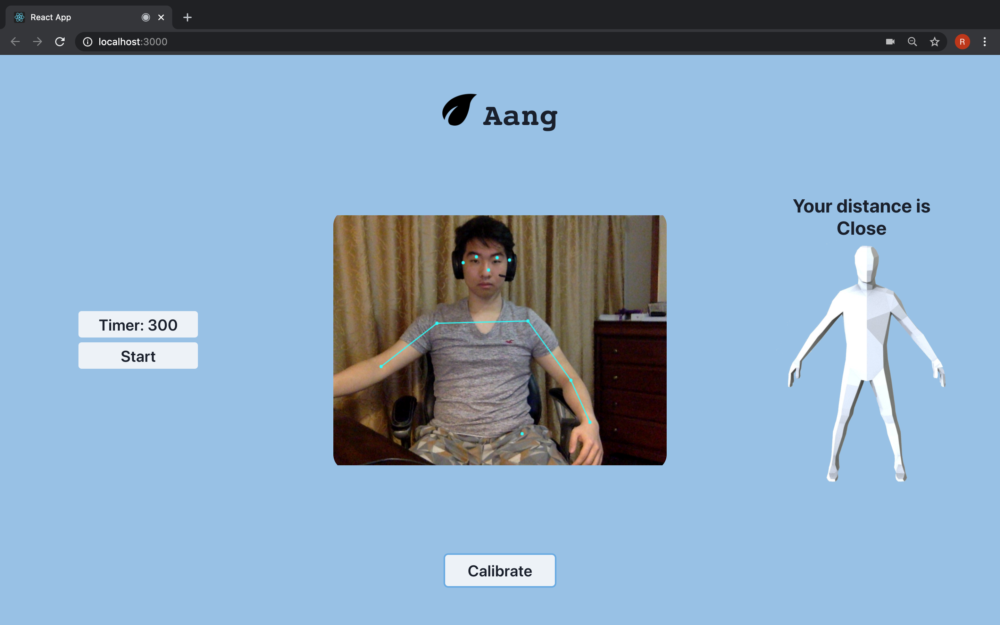
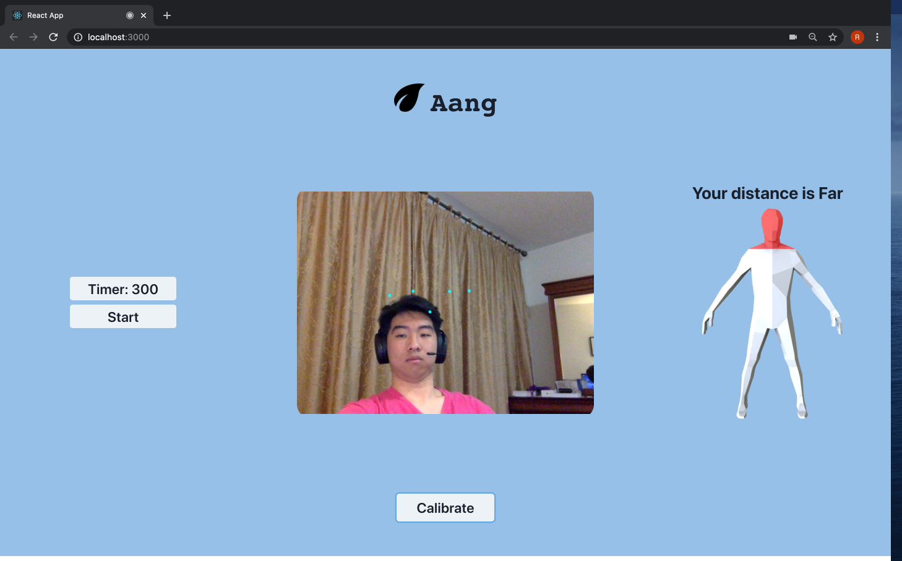
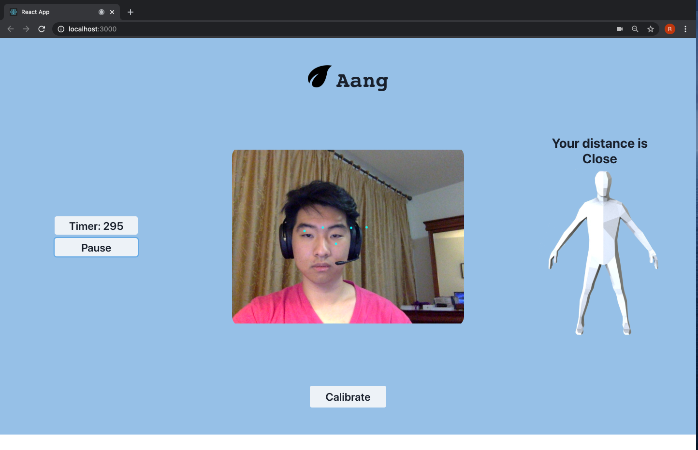
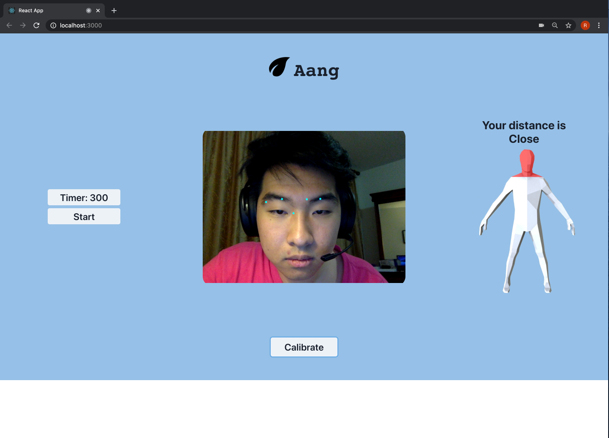

# The hack that fixes your back

> we've gotten really good at bending these past couple of months 

Made @ Hack the North 2020++

# A mindful webapp to track body posture while working at a computer with a webcam

### `npm start`

Runs the app in the development mode.\
Open [http://localhost:3000](http://localhost:3000) to view it in the browser.

# Usage

1. Calibrate your start position (stay still with good posture for 10 frames!)
2. Tracking dots will appear on your screen. After calibration, they will stay in your "optimal" position
3. Whenever you stray too far from your initial position, after a brief delay the model will highlight the affected body part

> Too far, bad posture

> Too close, good posture

>Too close, bad posture

# Features

- Detect changes in posture
- Displays whether the user is too far, neutral, or too close to the screen
- All in the browser to preserve user privacy
  - No pose data ever leaves the user's computer

# Cool stuff

- Tensorflow.js (posenet model)
- React.js
- Chakra UI
- Electron.js
